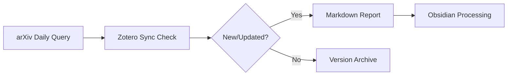

# arXiv Tools - Intelligent Literature Workflow Manager

**Author:** Ansatz Gong  
**Version:** 0.1.0 | Last Updated: 2025-02-23

## Background & Motivation

### Problem Statement
arXiv daily submissions may update article tags post-publication. Traditional workflows face two challenges:
1. **Metadata Synchronization Gap**: Local reading history (via browser clicks) isn't synced with arXiv accounts
2. **Version Drift Detection**: No native mechanism to detect newly added/updated articles in historical submissions

### Solution Overview
This toolset bridges arXiv metadata with Zotero reference management and Obsidian knowledge workflows by:


## Installation & Setup

### Prerequisites
#### Zotero Configuration:

Enable API access: Settings > Advanced > Miscellaneous > Allow other applications on this computer to communicate with Zotero ......

#### Python Environment:

```bash 
pip install .
```

#### Obsidian Setup (Optional):
install and activate plugins : `MetaEdit` `Dataview`


## Core Features
Intelligent Metadata Pipeline
```python 
from ArXiv_Tools.report import filter_arxiv_to_md
from ArXiv_Tools.arxiv_index_fetch import query_args

# Example: Generate quantum physics report for 2025-02
filter_arxiv_to_md(
    year=2025,
    month=2,
    md_folder=r'/path/to/obsidian/vault/arxiv_datas/quant-ph',
    query_args=query_args  # Customize arXiv categories
)
# you may write a schedule job to update data everyday.
```

## TO-DO

1. update function and remind 

2. add AI reading and sorting function


